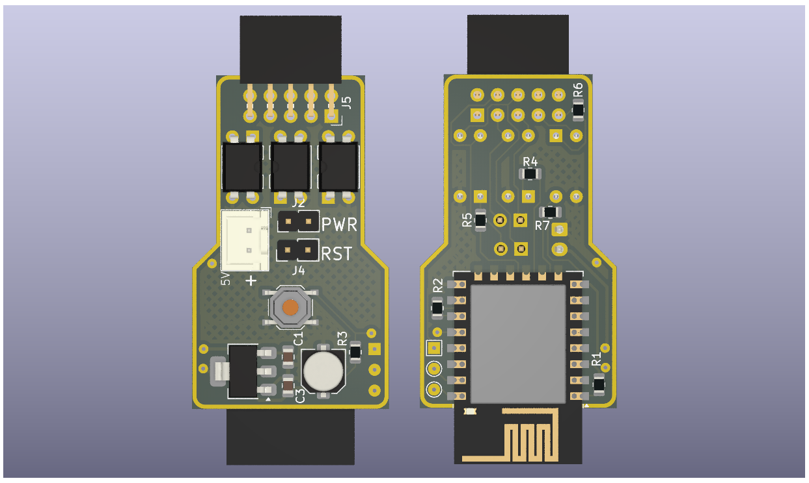

# RemotePC
> An ESP8266 powered PC addon card to remotely power it on using mqtt

## How to Build
You need a server to run your mqtt broker on. You can skip this and use a ready made service. The default setup runs MQTT over websocket with TLS. The PCB is designed to be printable at home ( All vias are open and accessible. THT components are soldered only from the other side. )
- Server
  - Get a server. A container even with host routing (no dedicated IP) would do
  - Generate passwords for your mqtt client and the ESP store them in `passwd`
  - After running the server make sure it works with the given test scripts

- ESP board
  - Create a secrets file and also fill in your servers CA certificate in `main.h`
  - For programming use the 3 test points. Hold the button before plugging power to set ESP to bootloader mode
  - Flash the ESP. You should be able to test it with the led command (will flash the on board LED)

The board is designed to be powered from PC 5V Standby. You can plug in your power and reset buttons to the header pins on the board

### Testing

Inside the `test` folder, JavaScript files can be run with Node.js to subscribe to or publish MQTT topics as tests.

### MQTT Topics

- `/pc_led`  
  Payload: `"on"` or `"off"`  
  Controls the onboard LED (on = LED ON, off = LED OFF).

- `/pc`    
  - `"get"`: Publishes current PC power state on `/pc_state` (`"on"` or `"off"`).  
  - `"power"`: Toggles PC power by pulsing the power pin.  
  - `"reset"`: Pulses the reset pin to reset the PC.

## License
[MIT](https://github.com/vahidtvj/RemotePC/blob/master/LICENCE) © [vahidtvj](https://github.com/vahidtvj)